[](https://github.com/jgauchia/IceNav-v3/actions/) 


ESP32 Based GPS Navigator (LVGL - LovyanGFX).
* Note: Under development (experimental features under devel branch)
* There is the possibility to use two types of maps: Rendered Maps or Tiles (large files), and Vector Maps (small files).

<table>
  <tr>
    <td>
      Don't forget to star ⭐️ this repository
    </td>
   <a href="https://www.buymeacoffee.com/jgauchia" target="_blank" title="buymeacoffee"></a>
  </tr>
</table>

> [!CAUTION]
> Do not use in production (Experimental features).

## Screenshots
|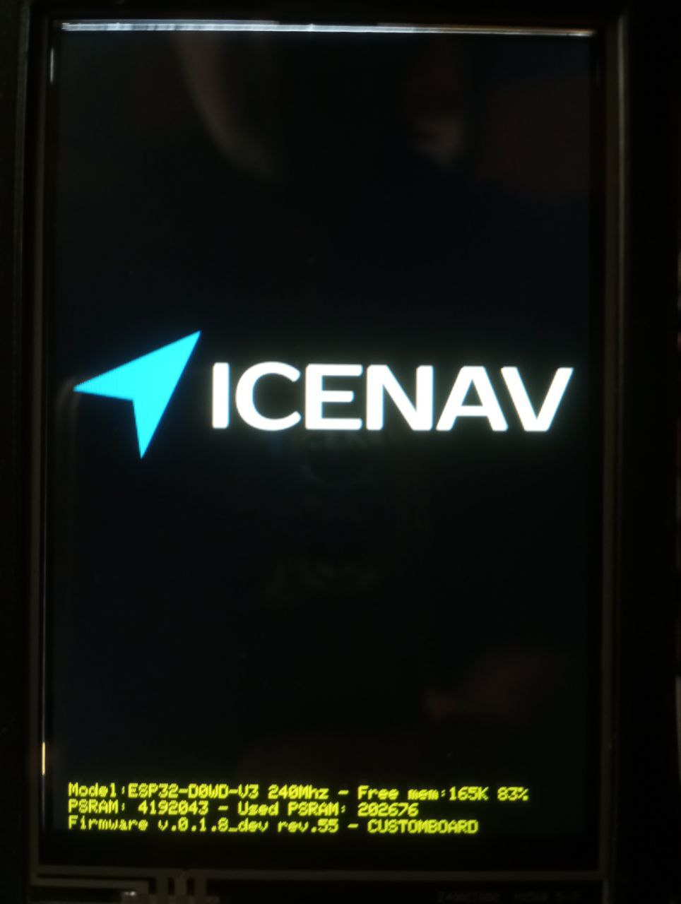|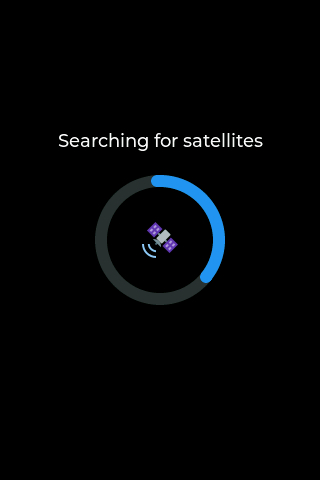|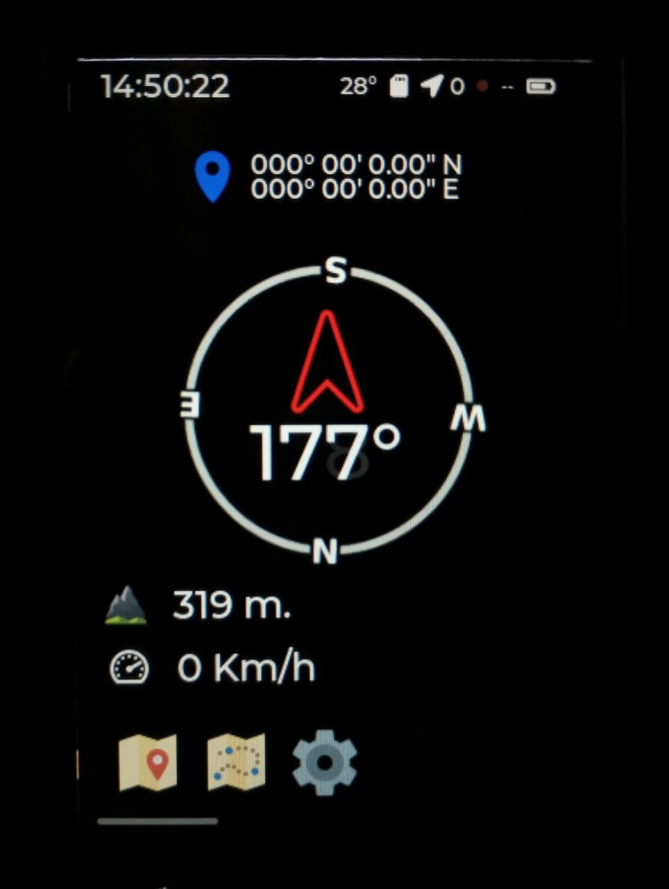|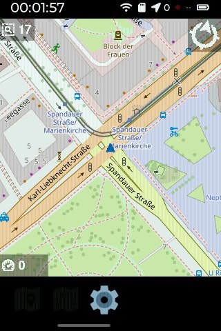|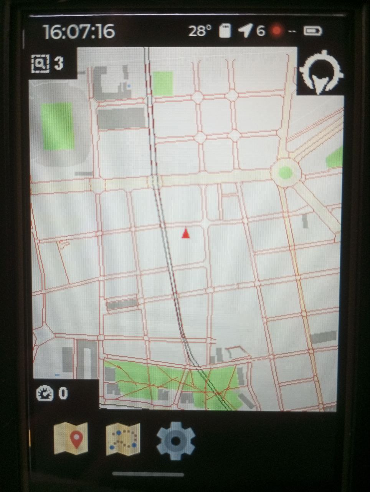|
|:-:|:-:|:-:|:-:|:-:|
| Splash Screen | Search Satellite | Compass | Rendered Map | Vectorized Map | 

||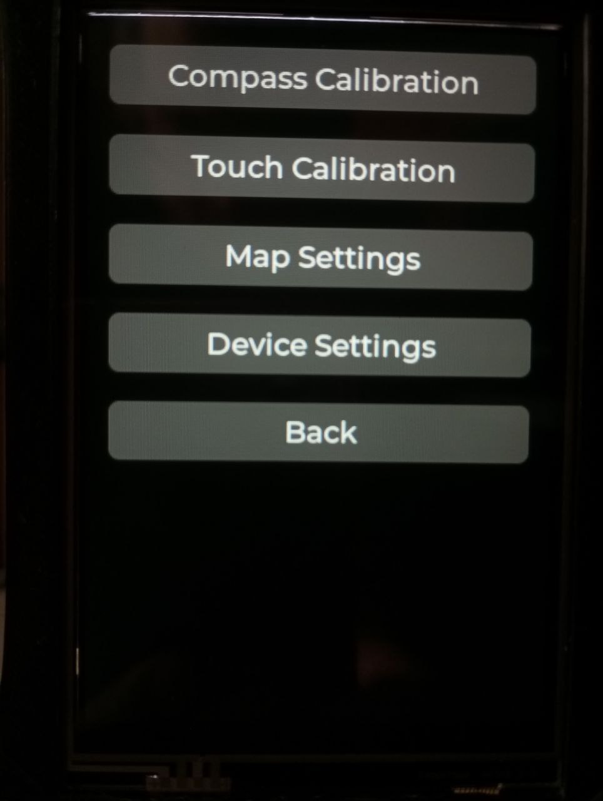|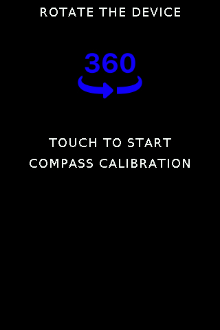|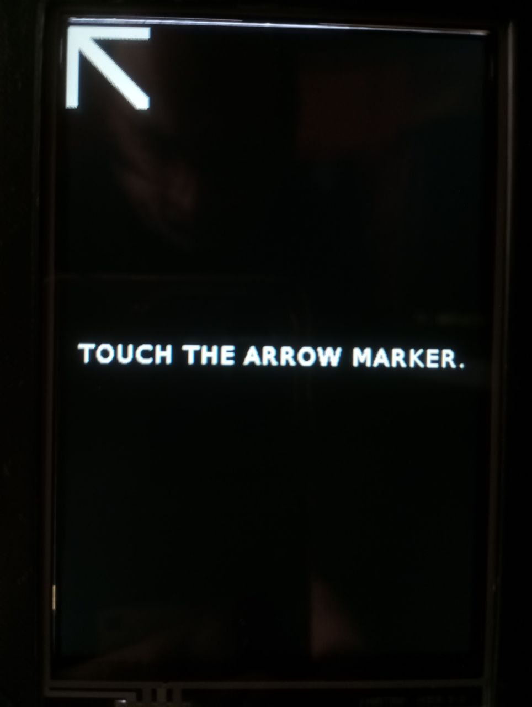|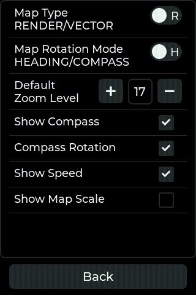|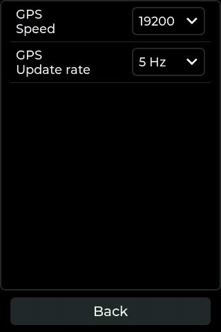|
|:-:|:-:|:-:|:-:|:-:|:-:|
| Satellite Info | Settings | Compass Calibration | Touch Calibration | Map Settings | Device Settings |

### WiFi CLI Manager


## Specifications

Currently, IceNav works with the following hardware setups and specs 

**Highly recommended an ESP32 with PSRAM** 
 
> [!IMPORTANT]
> Please review the platformio.ini file to choose the appropriate environment as well as the different build flags for your correct setup.

### Boards

|                  | FLASH | PSRAM | Environment                  |
|:-----------------|:-----:|:-----:|:-----------------------------|
| ESP32            |  16M  |  4M   | ``` [env:ESP32_N16R4] ```    |
| ESP32S3          |  16M  |  8M   | ``` [env:ESP32S3_N16R8] ```  |
| MAKERFAB ESP32S3 |  16M  |  2M   | ``` [env:MAKERF_ESP32S3] ``` |

### Screens

| Driver [^1] | Resolution | SPI | 8bit | 16bit | Touch     | Build Flags [^2]                 |
|:------------|:----------:|:---:|:----:|:-----:|:---------:|:---------------------------------|
| ILI9488     | 320x480    | yes | ---  | ---   | XPT2046   | ```-D ILI9488_XPT2046_SPI = 1``` |
| ILI9488     | 320x480    | --- | ---  | yes   | FT5x06    | ```-D ILI9488_FT5x06_16B = 1```  |
| ILI9341     | 320x240    | yes | ---  | ---   | XPT2046   | ```-D ILI9341_XPT2046_SPI = 1``` |

### Modules

|             | Type          | Build Flags [^2]                 | lib_deps [^3] (**no common environment**)              |
|:------------|:--------------|:---------------------------------|:-------------------------------------------------------|
| AT6558D     | GPS           | ```-D AT6558D_GPS = 1```         |                                                        |
| HMC5883L    | Compass       | ```-D HMC5883L = 1```            | ```adafruit/Adafruit Unified Sensor@^1.1.14``` <br> ```adafruit/Adafruit BusIO@^1.16.1``` <br> ```adafruit/Adafruit HMC5883 Unified@^1.2.3```|
| MPU9250     | IMU (Compass) | ```-D IMU_MPU9250 = 1 ```        | ```bolderflight/Bolder Flight Systems MPU9250@^1.0.2```|
| BME280      | Temp/Pres/Hum | ```-D BME280 = 1```              | ```adafruit/Adafruit Unified Sensor@^1.1.14``` <br> ```adafruit/Adafruit BusIO@^1.16.1``` <br> ```adafruit/Adafruit BME280 Library@^2.2.4```|


[^1]: See **hal.hpp** for pinouts configuration
[^2]: **platformio.ini** file under the build_flags section
[^3]: You need to add libraries dependencies if the buid flag requires

Other setups like another sensors types, etc... not listed in the specs, now **They are not included**

If you wish to add any other type of sensor, module, etc., you can create a PR without any problem, and we will try to implement it. Thank you!

---

## Wiring

See **hal.hpp** for pinouts configuration

## SD Map Tile File structure

Using [Maperitive](http://maperitive.net/) select your zone and generate your tiles. For that enter to `MAP-> Set Geometry bounds` draw or expand the square of your zone and run the command `generate-tiles minzoom=6 maxzoom=17`, It could takes long time, maybe 1 hour or more depending your area.

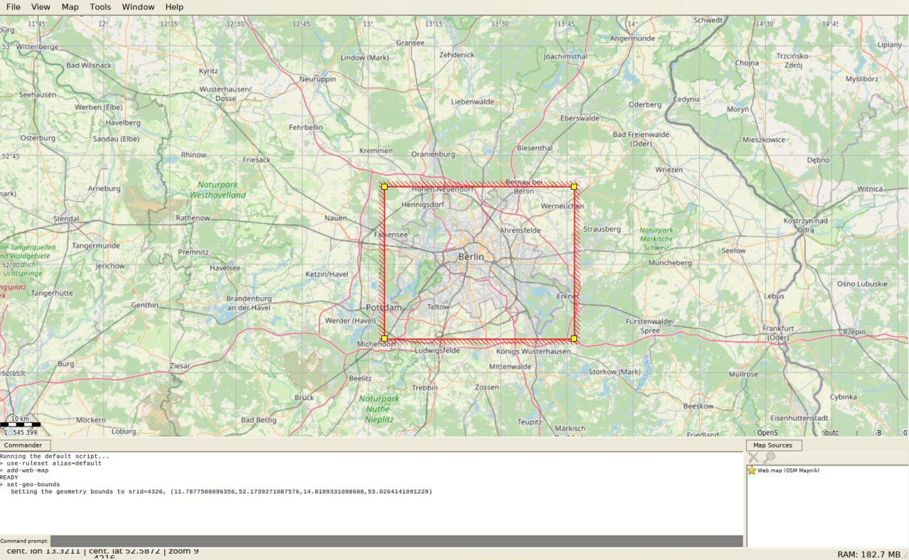

After that, copy the contents of directory `Tiles` into your SD in a directory called `MAP`.

On SD Card map tiles (256x256 PNG Format) should be stored, in these folders structure:

      [ MAP ]
         |________ [ zoom folder (number) ]
                              |__________________ [ tile X folder (number) ]
                                                             |_______________________ tile Y file.png

## SD Vectorized Map File structure          

Using [OSM_Extract](https://github.com/aresta/OSM_Extract) you can generate binary map files to later create vector maps. Once generated, these files should be saved in the `mymap` folder on the SD card.

The PBF files can be downloaded from the [geofabrik](https://download.geofabrik.de/) website.

The PBF files should be saved in the `pbf` directory. Once saved, you should select the region or boundaries for which the GeoJSON files will be generated.

To obtain the boundaries, please check the [geojson.io](http://geojson.io) website.

For generate GeoJSON files run inside `maps` directory:

```bash
ogr2ogr -t_srs EPSG:3857 -spat min_lon min_lat max_lon max_lat map_lines.geojson /pbf/downloaded.pbf lines

ogr2ogr -t_srs EPSG:3857 -spat min_lon min_lat max_lon max_lat map_polygons.geojson /pbf/downloaded.pbf multipolygons
```

For generate binary map files run inside `maps` directory.
```bash
/scripts/./extract_features.py min_lon min_lat max_lon max_lat map
```
Once the process is completed, the maps will be inside the `maps/mymap` directory. Copy all folders to the SD card except the `test_imgs` directory.

Please follow the instructions provided by [OSM_Extract](https://github.com/aresta/OSM_Extract) for any further questions.

## Firmware install


> [!IMPORTANT]
>Please install first [PlatformIO](http://platformio.org/) open source ecosystem for IoT development compatible with **Arduino** IDE and its command line tools (Windows, MacOs and Linux). Also, you may need to install [git](http://git-scm.com/) in your system.
> 
>For ESP32 board run:
> 
>```bash
>pio run --target upload
>```
>
>For ESP32S3 Makerfab board:
> 
>```bash
>pio run -e MAKERF_ESP32S3 --target upload
>```
>
> For Other boards:
>
> ```bash
> pio run -e environment --target upload
> ```
> 
> After the first run, load the icons and assets with:
> 
> ```bash
> pio run --target uploadfs
> ```


> [!TIP]
> Optional, for map debugging version with specific coordinates, build and install the firmware with the next environment variables, like this:
> 
> ```bash
> export ICENAV3_LAT=52.5200
> export ICENAV3_LON=13.4049
> pio run --target upload
> ```

> [!NOTE]
> For production version don't forget unset these environment variables.  

## CLI

IceNav has a basic CLI accessible via Serial and optionally via Telnet if enabled. When you access the CLI and type `help`, you should see the following commands:


```bash
clear:          clear shell
info:           get device information
nmcli:          network manager CLI.
reboot:         perform a ESP32 reboot
scshot:         screenshot to SD or sending a PC
```

Some extra details:

**nmcli**: IceNav use a `wcli` network manager library. For more details of this command and its sub commands please refer to [here](https://github.com/hpsaturn/esp32-wifi-cli?tab=readme-ov-file#readme)

**schot**: This utility can save a screenshot to the root of your SD, with the name: `screenshot.raw`. You can convert it to png using the `convert.py` script in the `tools` folder.

Additionally, this screenshot command can send the screenshot over WiFi using the following syntax:

```bash
scshot 192.168.1.10 8123
```

Ensure your PC has the specified port open and firewall access enabled to receive the screenshot via the `netcat` command, like this:

```bash
nc -l -p 8123 > screenshot.raw
```

### TO DO

- [X] LVGL 9 Integration
- [X] Support other resolutions and TFT models
- [X] Wifi CLI Manager
- [ ] GPX Integration
- [ ] Multiple IMU's and Compass module implementation
- [ ] Power saving
- [X] Vector maps
- [ ] Google Maps navigation style
- [x] Optimize code
- [ ] Fix bugs!
- [ ] Web file server
      
## Credits

* Added support to [Makerfabs ESP32-S3 Parallel TFT with Touch 3.5" ILI9488](https://www.makerfabs.com/esp32-s3-parallel-tft-with-touch-ili9488.html) thanks to [@hpsaturn](https://github.com/hpsaturn)
* Improved documentation thanks to [@hpsaturn](https://github.com/hpsaturn)
* Improved auto mainScreen selection from env variable preset thanks to [@hpsaturn](https://github.com/hpsaturn)
* Improved getLat getLon from environment variables thanks to [@hpsaturn](https://github.com/hpsaturn)
* 3DPrint case for an ESP32S3 Makerfabs Parallel board thanks to [@hpsaturn](https://github.com/hpsaturn)
* Vectorial Maps routines [ESP32_GPS](https://github.com/aresta/ESP32_GPS) thanks to [@aresta](https://github.com/aresta)
* OSM to binary vectorial maps [OSM_Extract](https://github.com/aresta/OSM_Extract) thanks to [@aresta](https://github.com/aresta)
* Preferences Library [Easy Preferences](https://github.com/hpsaturn/easy-preferences) thanks to [@hpsaturn](https://github.com/hpsaturn)
* Wifi CLI manager [esp32-wifi-cli](https://github.com/hpsaturn/esp32-wifi-cli) thanks to [@hpsaturn](https://github.com/hpsaturn)
