[](https://github.com/jgauchia/IceNav-v3/actions/workflows/platformio.yml) [](https://github.com/jgauchia/IceNav-v3/actions/workflows/devel.yml) 

<div align="center">

<h3>ESP32 Based GPS Navigator (LVGL - LovyanGFX).</h3>
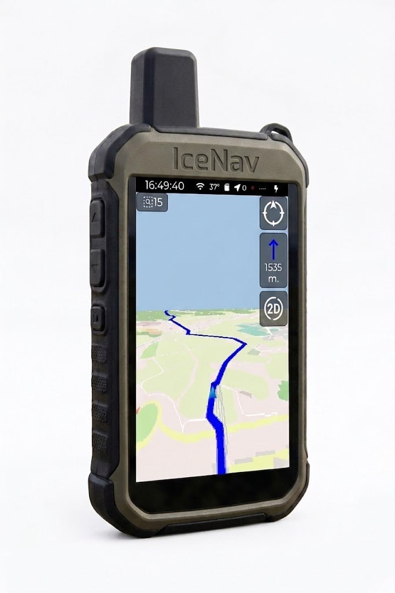
<br>
<em>Conceptual design — not final hardware.<br></em>
<br>
</div>

* Note: Under development (experimental features under devel branch)
* There is the possibility to use two types of maps: Rendered Maps or Tiles (large files), and Vector Maps (small files).
* Recommended to use an ESP32-S3 or ESP32-P4 with PSRAM and a screen with a parallel bus for optimal performance, although SPI screens also yield good results.

<div align="center">
  Don't forget to star ⭐️ this repository
  <br>
  <a href="https://www.buymeacoffee.com/jgauchia" target="_blank" title="buymeacoffee"></a>
</div>

## Screenshots

|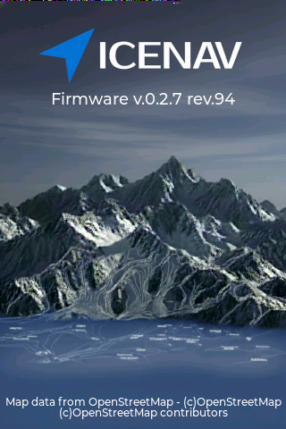|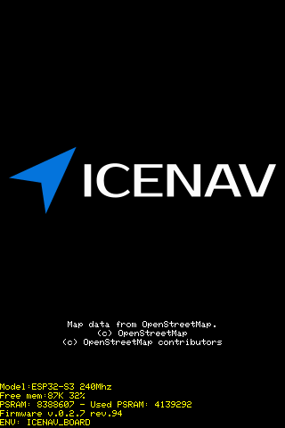|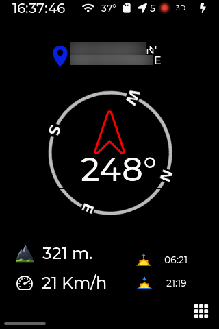|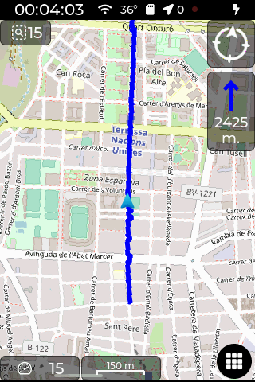|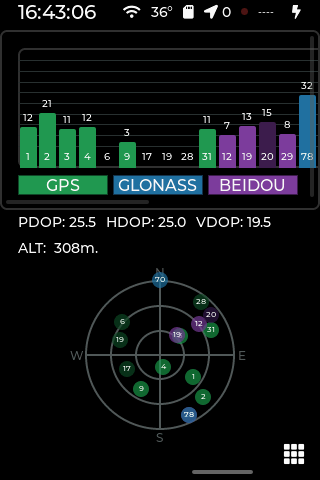|
|:-:|:-:|:-:|:-:|:-:|

<details><summary>See more...</summary>
  
||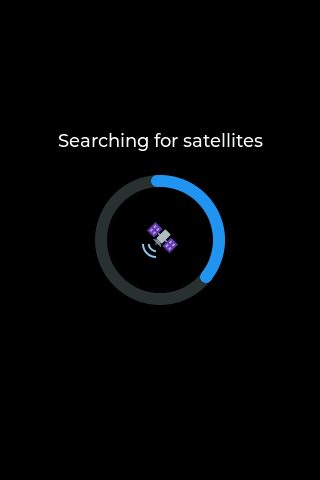||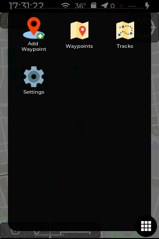|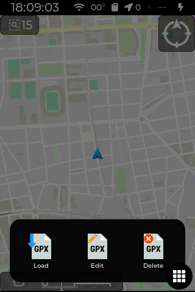|
|:-:|:-:|:-:|:-:|:-:|
| Splash Screen | Search Satellite | Compass[^5] | Main Options | Waypoint/Track Options |

|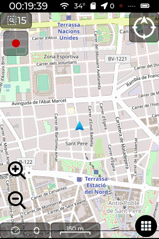|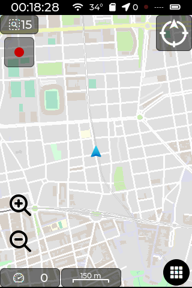|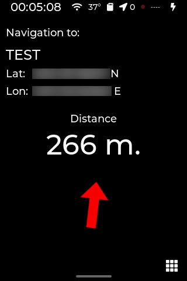|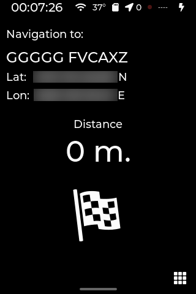||
|:-:|:-:|:-:|:-:|:-:|
| Rendered Map | Vectorized Map | Navigation Screen | Navigation Screen | Satellite Info |

|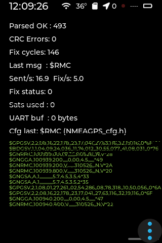|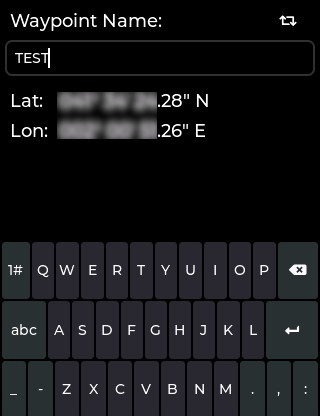|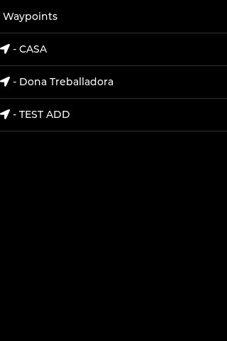||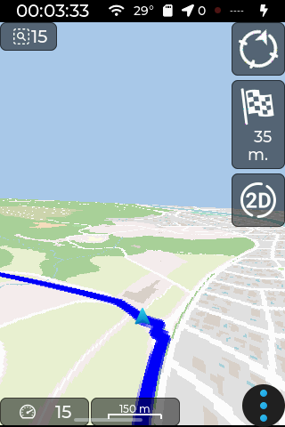|
|:-:|:-:|:-:|:-:|:-:|
| NMEA Debug | Add Waypoint | Waypoint List | Track List | 3D Map view |

|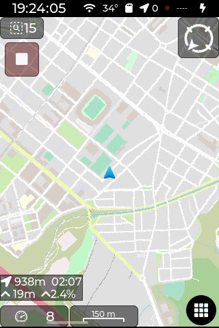|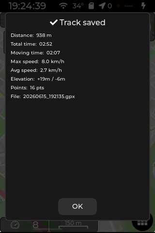|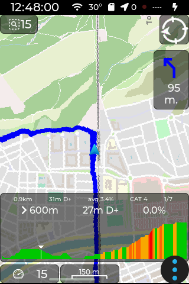|
|:-:|:-:|:-:|
| GPS Logger | GPS Logger | Climb Analyzer |

|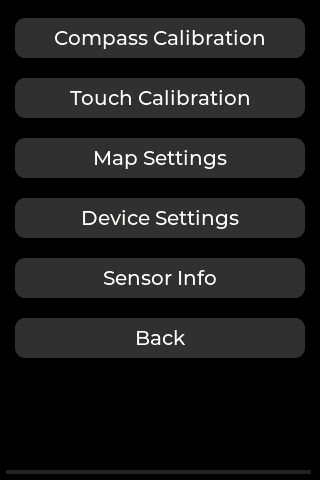|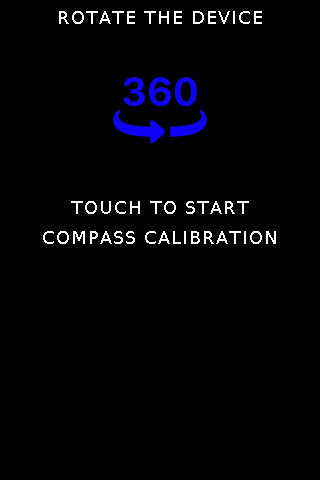|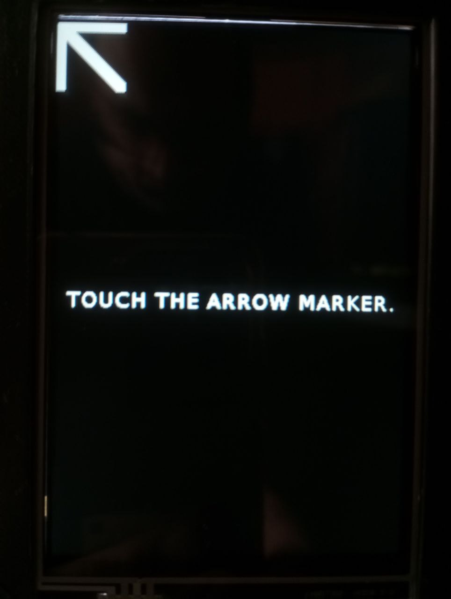|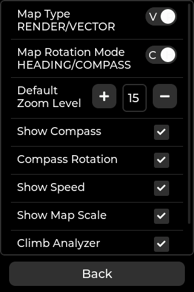|
|:-:|:-:|:-:|:-:|
| Settings | Compass Calibration | Touch Calibration | Map Settings |

|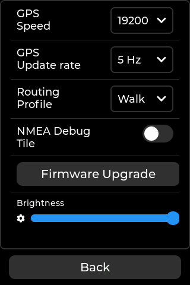|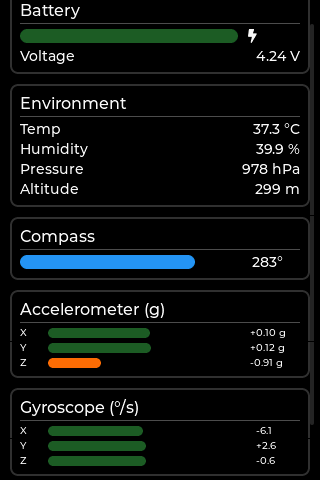|
|:-:|:-:|
| Device Settings | Sensor Info | 

### LilyGo T-DECK

|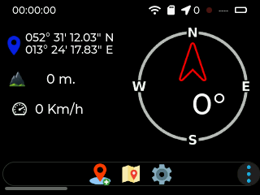|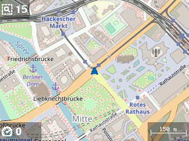|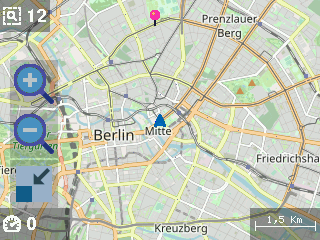|
|:-:|:-:|:-:|
| Compass | Rendered Map | Waypoint on Map |

|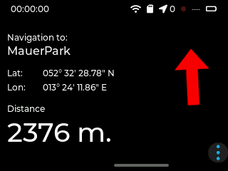|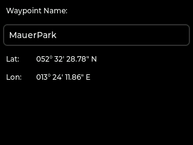|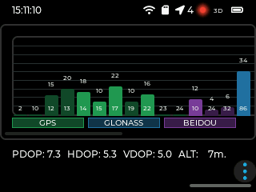|
|:-:|:-:|:-:|
| Navigation Screen | Edit Waypoint | Satellite Info |

### WiFi CLI Manager
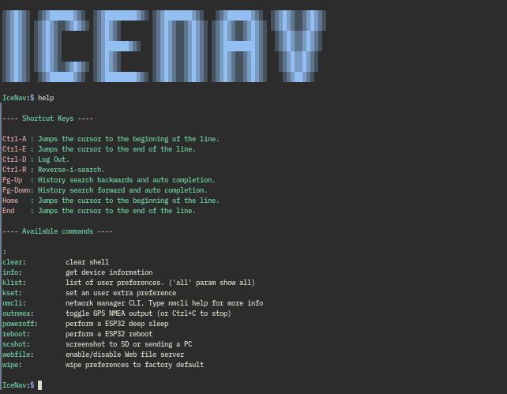

### Web File Server 
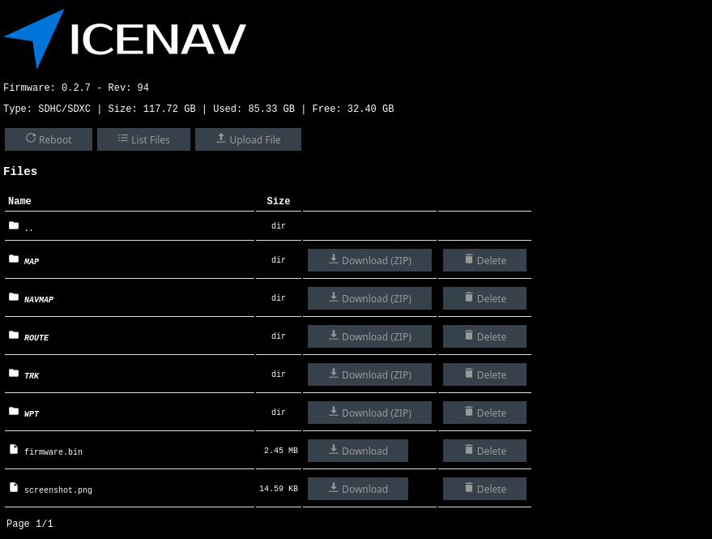

</details>

## Specifications

Currently, IceNav works with the following hardware setups and specs

**Highly recommended an ESP32S3 or ESP32P4 with PSRAM and 320x480 Screen** 
 
> [!IMPORTANT]
> Please review the platformio.ini file to choose the appropriate environment as well as the different build flags for your correct setup.
> Support for ESP32-S2 is discontinued due to IRAM issues.

### Boards

|                        | FLASH | PSRAM | Environment [^2]             | Full Support |
|:-----------------------|:-----:|:-----:|:-----------------------------|--------------|
| ICENAV (Custom ESP32S3) |  16M  |  8M   | ``` [env:ICENAV_BOARD] ```   |    ✔️ YES      |
| ESP32S3                |  16M  |  8M   | ``` [env:ESP32S3_N16R8] ```  |    ✔️ YES      |
| [ELECROW ESP32 Terminal](https://www.elecrow.com/esp-terminal-with-esp32-3-5-inch-parallel-480x320-tft-capacitive-touch-display-rgb-by-chip-ili9488.html) |  16M  |  8M   | ``` [env:ELECROW_ESP32] ```  | ✔️ YES [^1] |
| [MAKERFABS ESP32S3](https://www.makerfabs.com/esp32-s3-parallel-tft-with-touch-ili9488.html) |  16M  |  2M   | ``` [env:MAKERF_ESP32S3] ``` |  🚧 TESTING    |
| [LILYGO T-DECK](https://www.lilygo.cc/products/t-deck) |  16M  |  8M   | ``` [env:TDECK_ESP32S3] ``` |  ✔️ YES    |
| [LILYGO T-DECK PLUS](https://lilygo.cc/en-us/products/t-deck-plus-1) | 16M | 8M | ``` [env:TDECK_ESP32S3] ``` |  🚧 TESTING    |
| [LILYGO T4-S3](https://lilygo.cc/products/t4-s3) | 16M | 8M | ``` [env:T4_S3] ``` | ✔️ YES    |
| [WAVESHARE ESP32-P4-WIFI6 3.5inch Smart Vision ](https://www.waveshare.com/product/esp32-related/esp32-p4-wifi6-touch-lcd-3.5.htm) | 16M | 32M | ``` [env:WAVESHARE_P4_35] ``` | ✔️ YES    |
| [WAVESHARE ESP32-P4-WIFI6 4.3inch Development Board](https://www.waveshare.com/product/esp32-related/displays/lcd-mipi/esp32-p4-wifi6-touch-lcd-4.3.htm) | 32M | 32M | ``` [env:WAVESHARE_P4_43] ``` | ✔️ YES   |


> [!IMPORTANT]
> Known Issue: ESP32-P4 + ESP32-C6 — Reboots with SD + WiFi 
>On boards that pair an ESP32-P4 with an ESP32-C6 co-processor (e.g. WAVESHARE_P4_43), enabling WiFi while an SD card is mounted via SDMMC can cause intermittent crashes or reboots. The backtrace typically shows `sdio_read` → `xRingbufferCreateStatic`.
>**Root cause:** The SDMMC peripheral is shared between the SD card slot and the C6 SDIO link. The ESP-Hosted MCU firmware does not properly serialise concurrent access, leading to a corrupted ring buffer allocation and a system panic.
>This is a known ESP-Hosted firmware bug, tracked upstream at https://github.com/espressif/esp-hosted-mcu/issues/144 and #184. Espressif has acknowledged it; a fix is expected in a future release.
>**Workaround:** Disable WiFi via CLI Settings 


If the board has a BOOT button it is possible to use power saving functions.
To do this, simply include the following Build Flags in the required env in platformio.ini

```-DPOWER_SAVE``` <br>
```-DINVERT_BOOT_PIN``` (if the button signal is inverted, e.g. Waveshare P4 boards) <br>

> [!IMPORTANT]
> Currently, this project can run on any board with an ESP32S3 and at least a 320x480 TFT screen. The idea is to support all existing boards on the market that I can get to work, so if you don't want to use the specific IceNav board, please feel free to create an issue, and I will look into providing support.
> Any help or contribution is always welcome


### Screens

| Driver [^2] | Resolution | SPI | 8bit | 16bit | Touch     | Build Flags [^3]                 |
|:------------|:----------:|:---:|:----:|:-----:|:---------:|:---------------------------------|
| ILI9488 [^4]| 320x480    | ✔️ |  ➖  |  ➖  | XPT2046   | ```-DILI9488_XPT2046_SPI```      |
| ILI9488     | 320x480    | ✔️ |  ➖  |  ➖  | FT5x06    | ```-DILI9488_FT5x06_SPI```       |
| ILI9488     | 320x480    | ➖ |  ✔️  |  ➖  |    ➖    | ```-DILI9488_NOTOUCH_8B```       |
| ILI9488     | 320x480    | ➖ |   ➖ |  ✔️  | FT5x06    | ```-DILI9488_FT5x06_16B```       |
| ILI9341     | 320x240    | ✔️ |  ➖  |  ➖  | XPT2046   | ```-DILI9341_XPT2046_SPI```      |
| ILI9341     | 320x240    | ✔️ |  ➖  |  ➖  |   ➖   | ```-DILI9341_NOTOUCH_SPI```      |

> [!IMPORTANT]
> If you are using a TFT with SPI shared bus, for example with an SD card, you need to add the following buildflag:
> ```-DSPI_SHARED```

### Modules

|             | Type          | Build Flags [^3]                   | 
|:------------|:--------------|:-----------------------------------|
|             | 🔋 Batt. Monitor | ```-DBATT_ADC_UNIT=n``` (1 or 2) <br> ```-DBATT_ADC_CHANNEL=x``` <br> ```-DBATT_DIVIDER_R1=n``` (default 100000) <br> ```-DBATT_DIVIDER_R2=n``` (default 100000) |  
| AT6558D     | 🛰️ GPS        | ```-DAT6558D_GPS```                |
| HMC5883L / QMC5883 | 🧭 Compass (auto-detected) | ```-DCOMPASS_AUTO```        |
| MPU9250     | 🧭 IMU (Compass) | ```-DIMU_MPU9250```                | 
| BME280      | 🌡️ Temp <br> ☁️ Pres <br> 💧 Hum | ```-DBME280```                     |
| MPU6050     | 📳 IMU | ```-DMPU6050```                     |


[^1]: For ELECROW board UART port is shared with USB connection, GPS pinout are mapped to IO19 and IO40 (Analog and Digital Port). If CLI isn't used is possible to attach GPS module to UART port but for upload the firmware (change pinout at **hal.hpp**), the module should be disconnected.
[^2]: See **hal.hpp** for pinouts configuration
[^3]: **platformio.ini** file under the build_flags section
[^4]: If Touch SPI is wired to the same SPI of ILI9488 ensure that TFT MISO line has 3-STATE for screenshots (read GRAM) or leave out 
[^5]: Widgets are draggable

Other setups like another sensors types, etc... not listed in the specs, now **They are not included**

If you wish to add any other type of sensor, module, etc., you can create a PR without any problem, and we will try to implement it. Thank you!

### IMU Accelerometer Axis Configuration

When using an IMU for tilt-compensated heading (`-DMPU6050` or `-DIMU_MPU9250`), the physical mounting orientation must be configured via build flags.

| Flag | Default | Description |
|:-----|:--------|:------------|
| `-DIMU_ACCEL_X_SIGN` | `1` | Sign applied to raw ax (+1 or -1) |
| `-DIMU_ACCEL_Y_SIGN` | `1` | Sign applied to raw ay (+1 or -1) |
| `-DIMU_ACCEL_Z_SIGN` | `1` | Sign applied to raw az (+1 or -1) |

The correct value for each axis depends on how the IMU is physically mounted. If tilting the device causes the heading to drift instead of remaining stable, invert the sign of the affected axis.

These flags can be set either in the board definition JSON (`boards/*.json`) under `extra_flags`, or in `platformio.ini` under `build_flags` for the target environment.

## Wiring

See **hal.hpp** for pinouts configuration

## SD Card File Structure

IceNav reads every map, route, track and waypoint from the SD card. The [SD Card File Structure](docs/sd-card-file-structure.md) document describes the folder layout of each data type — rendered tiles, vectorized maps, A* routes, GPX tracks and waypoints — and how to generate the map and route files.

## Mass Copy Script for Map Tiles

For efficient transfer of millions of map tiles to SD cards or external storage devices, IceNav includes a high-performance mass copy script. This script is optimized for copying large numbers of small files (such as map tiles) and can reduce transfer time from hours to minutes.

**Key features:**
- ✅ **Optimized for millions of small files** - Much faster than traditional copy methods
- ✅ **Real-time progress monitoring** - See exactly what's being copied
- ✅ **Resumable transfers** - Continue interrupted copies
- ✅ **Built-in integrity verification** - Sample file verification
- ✅ **Performance metrics** - Speed and time statistics

For detailed instructions on how to use the mass copy script, please refer to the [Mass Copy Tools Documentation](docs/mass-copy.md).

Download link: [tools/mass_copy/rsync_copy.sh](tools/mass_copy/rsync_copy.sh)

## Firmware install


> [!IMPORTANT]
>Please install first [PlatformIO](http://platformio.org/) open source ecosystem for IoT development compatible with **Arduino** IDE and its command line tools (Windows, MacOs and Linux). Also, you may need to install [git](http://git-scm.com/) in your system.
> 
>For ICENAV board run:
> 
>```bash
>pio run --target upload
>```
>
>For ESP32S3 Makerfab board:
> 
>```bash
>pio run -e MAKERF_ESP32S3 --target upload
>```
>
> For Other boards:
>
> ```bash
> pio run -e environment --target upload
> ```
> 
> After this, load the icons and assets with:
> 
> ```bash
> pio run --target uploadfs
> ```

> [!TIP]
> Optional, firmware upgrade is possible from SD Card, please see [PR #259](https://github.com/jgauchia/IceNav-v3/pull/259) for detailed instructions

> [!TIP]
> Optional, for map debugging with specific coordinates, or when you are in indoors, you are able to set the defaults coordinates, on two ways:

### Via Docker

First, build the Docker image for your system, using the following command line:

```bash
docker build --build-arg DOCKER_USER=$USER --build-arg DOCKER_USERID=$UID -t platformio-core:master .
```

(don't forget the last point in the line)

This will build a basic compiler image with all PlatformIO (Pioarduino) stuff. You need perform this step, just **only one time**.

Then, for build the project or default firmware, you only needs to run the next command, each time that you need, for instance:

```bash
./docker_build run -e TDECK_ESP32S3
```

For build and upload to your device you should specific the port, for instance:

```bash
PORT=/dev/ttyACM0 ./docker_build run -e TDECK_ESP32S3 --target upload
```

After build and upload. If you want, you can remove the hidden directories `.platformio` and `.cache` for free space in your disk.

## Using the builtin CLI

>
> Using the next commands to set your default coordinates, for instance:
>
> ```bash
> klist
> kset defLAT 52.5200
> kset defLON 13.4049
> ```
> 
> **Using enviroment variables**:
>
> Export your coordinates before to build and upload, for instance:
> 
> ```bash
> export ICENAV3_LAT=52.5200
> export ICENAV3_LON=13.4049
> pio run --target upload
> ```

## Crash diagnostics

On every boot IceNav logs the reset reason (power-on, panic, watchdog, brownout...) to the serial monitor and appends it to `DIAG.log` in the SD card root, along with the firmware version.

If the previous session ended in a crash, the ESP32 automatically stores a core dump in a dedicated flash partition. On the next boot with an SD card present, IceNav:

- Appends a crash summary to `DIAG.log` (faulting task, program counter, exception cause and backtrace).
- Copies the full core dump to `COREDUMP.elf` in the SD card root.
- Erases the flash partition, ready for the next crash.

To get a full decoded report (source file and line for each backtrace frame), analyze `COREDUMP.elf` on your PC with the `espcoredump.py` tool included with ESP-IDF/PlatformIO, using the ELF of the same firmware build (`.pio/build/<environment>/firmware.elf`):

```bash
espcoredump.py info_corefile -c COREDUMP.elf -t elf .pio/build/ICENAV_BOARD/firmware.elf
```

> [!TIP]
> If there is no SD card inserted, the core dump is kept in flash (the serial monitor shows `coredump stored` at boot) and will be recovered on the first boot with an SD card. Alternatively it can be extracted over USB without SD card:
>
> ```bash
> espcoredump.py --port /dev/ttyACM0 info_corefile .pio/build/ICENAV_BOARD/firmware.elf
> ```

## CLI

IceNav has a basic CLI accessible via Serial and optionally via Telnet if enabled (port 11000). When you access the CLI and type `help`, you should see the following commands:

```bash
clear:          clear shell
info:           get device information
klist:          list of user preferences. ('all' param show all)
kset:           set an user extra preference
mem:            memory snapshot (heap, LVGL, stacks)
nmcli:          network manager CLI. Type nmcli help for more info
outnmea:        toggle GPS NMEA output (or Ctrl+C to stop)
poweroff:       perform a ESP32 deep sleep
reboot:         perform a ESP32 reboot
scshot:         screenshot to SD or sending a PC
webfile:        enable/disable Web file server
wipe:           wipe preferences to factory default
```

For more details about these commands, see [CLI documentation](docs/cli.md).

## Web File Server 

IceNav has a small web file server (https://youtu.be/IYLcdP40cU4) to manage existing files on the SD card.
An active WiFi connection is required (to do this, see how to do it using CLI).

The Web File Server will start automatically if default automatic network connection is enabled (see CLI).

To access the Web File Server, simply use any browser and go to the following address: http://icenav.local

**Known issue (ESP32-P4 boards):** uploading files crashes the device
(`assert failed: sdio_rx_get_buffer`). This is a known upstream bug in the ESP-Hosted SDIO
driver used for WiFi on the C6 co-processor
([espressif/esp-hosted-mcu#144](https://github.com/espressif/esp-hosted-mcu/issues/144),
[#184](https://github.com/espressif/esp-hosted-mcu/issues/184)), not fixable from this project.
Two triggers confirmed: uploading a file larger than ~100KB, and uploading any file (even a
few hundred bytes) into a new folder that has to be created on the SD card. Uploading into an
existing folder works fine for small files. Downloading files is not affected. Track the
upstream issues for a fix.

   

## Special thanks to....
* [@hpsaturn](https://github.com/hpsaturn) Thanks to him and his knowledge, this project is no longer sitting in a drawer :smirk:.
* [@Xinyuan-LilyGO](https://github.com/Xinyuan-LilyGO) for provide me hardware to test it.
* [@waveshareteam](https://github.com/waveshareteam) for provide me latest ESP32P4 hardware to test it.
* [@Elecrow-RD](https://github.com/Elecrow-RD)  For your interest in my project and for providing me with hardware to test it.
* [@pcbway](https://github.com/pcbway) for bringing a first prototype of the IceNav PCB to reality :muscle:
* [@lovyan03](https://github.com/lovyan03/LovyanGFX) for his library; I still have a lot to learn from it.
* [@lvgl](https://github.com/lvgl/lvgl) for creating an amazing UI
* And of course, to my family, who supports me through all this development and doesn’t understand why. :kissing_heart: I will never be able to thank you enough for the time I've dedicated.


## Credits

* Added support to [Makerfabs ESP32-S3 Parallel TFT with Touch 3.5" ILI9488](https://www.makerfabs.com/esp32-s3-parallel-tft-with-touch-ili9488.html) from [@makerfabs](https://github.com/makerfabs) thanks to [@hpsaturn](https://github.com/hpsaturn) to test it!
* Improved documentation thanks to [@hpsaturn](https://github.com/hpsaturn)
* Improved auto mainScreen selection from env variable preset thanks to [@hpsaturn](https://github.com/hpsaturn)
* Improved getLat getLon from environment variables thanks to [@hpsaturn](https://github.com/hpsaturn)
* 3DPrint case for an ESP32S3 Makerfabs Parallel board thanks to [@hpsaturn](https://github.com/hpsaturn)
* Preferences Library [Easy Preferences](https://github.com/hpsaturn/easy-preferences) thanks to [@hpsaturn](https://github.com/hpsaturn)
* Wifi CLI manager [esp32-wifi-cli](https://github.com/hpsaturn/esp32-wifi-cli) thanks to [@hpsaturn](https://github.com/hpsaturn)
* Web file server based in [@smford](https://github.com/smford) [esp32-asyncwebserver-fileupload-example](https://github.com/smford/esp32-asyncwebserver-fileupload-example)
* Solar sunset and sunrise [SolarCalculator](https://github.com/jpb10/SolarCalculator) thanks to [@jpb10](https://github.com/jpb10)


---
Map data is available thanks to the great OpenStreetMap project and contributors. The map data is available under the Open Database License.

[© OpenStreetMap contributors](https://www.openstreetmap.org/copyright)
