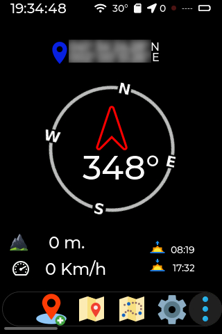
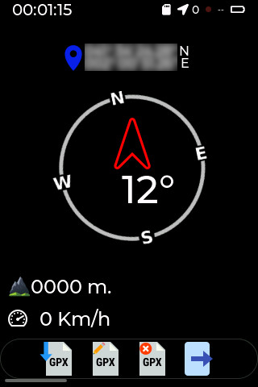

[](https://github.com/jgauchia/IceNav-v3/actions/) 


**ESP32 Based GPS Navigator (LVGL - LovyanGFX)**

- **Status:** Under development (experimental features under `devel` branch)
- Supports two types of maps: Rendered Tiles (large files) and Vector Maps (small files).
- **Recommended:** ESP32-S3 with PSRAM and a parallel bus display for best performance. Other ESP32 models and SPI screens are supported but may have lower performance.

<table>
  <tr>
    <td>
      Don't forget to star ⭐️ this repository
    </td>
    <td>
      <a href="https://www.buymeacoffee.com/jgauchia" target="_blank" title="buymeacoffee"></a>
    </td>
  </tr>
</table>

> [!CAUTION]
> Do not use in production (Experimental features).

---

## Screenshots

|||||
|:-:|:-:|:-:|:-:|

<details><summary>See more...</summary>
  
||||||
|:-:|:-:|:-:|:-:|:-:|
| Splash Screen | Search Satellite | Compass | Main Options | Wpt/Track Options |

||||||
|:-:|:-:|:-:|:-:|:-:|
| Rendered Map | Vectorized Map | Navigation Screen | Navigation Screen | Satellite Info |

||||
|:-:|:-:|:-:|
| Add Waypoint | Add Waypoint (landscape) | Waypoint List |

||||||
|:-:|:-:|:-:|:-:|:-:|
| Settings | Compass Calibration | Touch Calibration | Map Settings | Device Settings |

LilyGo T-DECK

||||
|:-:|:-:|:-:|
| Compass | Rendered Map | Waypoint on Map |

||||
|:-:|:-:|:-:|
| Navigation Screen | Edit Waypoint | Satellite Info |

### WiFi CLI Manager


### Web File Server 


</details>

---

## Modular PlatformIO: Feature Blocks (`[feat_xxx]`)

IceNav uses a **modular configuration** in `platformio.ini`:
- Each hardware feature (battery monitor, GPS, IMU, display, etc.) is defined in a `[feat_xxx]` section.
- Each environment (`[env:...]`) extends `[common]` plus the required feature blocks.
- To add hardware or combine features, simply extend with the relevant feature blocks and concatenate their `build_flags` and `lib_deps`.
  
> [!IMPORTANT]
> If a `[feat_xxx]` block defines its own `lib_deps` or `build_flags`, **concatenate them** in your `[env:...]` as shown below.

<details><summary>Example: Environment with Features</summary>

```ini
[env:ICENAV_BOARD]
extends = common, feat_battmon, feat_gps_at6558, feat_power, feat_comp_hmc, feat_imu_mpu6050, feat_bme280, feat_scr_9488_xpt
board = icenav-esp32-s3

build_flags =
    ${common.build_flags}
    ${feat_battmon.build_flags}
    ${feat_gps_at6558.build_flags}
    ${feat_power.build_flags}
    ${feat_comp_hmc.build_flags}
    ${feat_imu_mpu6050.build_flags}
    ${feat_bme280.build_flags}
    ${feat_scr_9488_xpt.build_flags}

lib_deps =
    ${common.lib_deps}
    ${feat_imu_mpu6050.lib_deps}
    ${feat_comp_hmc.lib_deps}
    ${feat_bme280.lib_deps}
```
</details>

**How to add a new board or configuration:**  
See [How to Add New Hardware](docs/NEW_HARDWARE_ENV.md) for step-by-step instructions and best practices.

---

## Specifications

Currently, IceNav works with the following hardware setups and specs

**Highly recommended an ESP32S3 with PSRAM and 320x480 Screen** 
 
> [!IMPORTANT]
> Check the `platformio.ini` file to select the right environment and build flags/features for your setup.

### Boards

|                        | FLASH | PSRAM | Environment                  | Full Support |
|:-----------------------|:-----:|:-----:|:-----------------------------|--------------|
| ICENAV (Custom ESP32S3) |  16M  |  8M   | ``` [env:ICENAV_BOARD] ```   |    ✔️ YES      |
| ESP32                  |  16M  |  4M   | ``` [env:ESP32_N16R4] ```    |    ✔️ YES      |
| ESP32S3                |  16M  |  8M   | ``` [env:ESP32S3_N16R8] ```  |    ✔️ YES      |
| [ELECROW ESP32 Terminal](https://www.elecrow.com/esp-terminal-with-esp32-3-5-inch-parallel-480x320-tft-capacitive-touch-display-rgb-by-chip-ili9488.html) |  16M  |  8M   | ``` [env:ELECROW_ESP32] ```  | ✔️ YES [^1] [^2]|
| [MAKERFABS ESP32S3](https://www.makerfabs.com/esp32-s3-parallel-tft-with-touch-ili9488.html) |  16M  |  2M   | ``` [env:MAKERF_ESP32S3] ``` |  🚧 TESTING    |
| [LILYGO T-DECK](https://www.lilygo.cc/products/t-deck) |  16M  |  8M   | ``` [env:TDECK_ESP32S3] ``` |  ✔️ YES    |

### Supported Displays

| Driver [^2] | Resolution | SPI | 8bit | 16bit | Touch     | Feature Block [^3]                 |
|:------------|:----------:|:---:|:----:|:-----:|:---------:|:---------------------------------|
| ILI9488 [^4]| 320x480    | ✔️ |  ➖  |  ➖  | XPT2046   | `[feat_scr_9488_xpt]`       |
| ILI9488     | 320x480    | ✔️ |  ➖  |  ➖  | FT5x06    | `[feat_scr_9488_ft5x]`        |
| ILI9488     | 320x480    | ➖ |  ✔️  |  ➖  |    ➖    | `[feat_scr_9488_nt8b]`        |
| ILI9488     | 320x480    | ➖ |   ➖ |  ✔️  | FT5x06    | `[feat_scr_9488_ft5x_16b]`       |
| ILI9341     | 320x240    | ✔️ |  ➖  |  ➖  | XPT2046   | `[feat_scr_9341_xpt]`       |
| ILI9341     | 320x240    | ✔️ |  ➖  |  ➖  |   ➖   | `[feat_scr_9341_notouch]`       |

> [!IMPORTANT]
> If you use a TFT with a shared SPI bus (e.g., with an SD), add the feature block `[feat_spi_shared]`.

### Modules & Features

|             | Type          | Feature Block [^3]                   | lib_deps [^5] (auto-included by feature)             |
|:------------|:--------------|:-----------------------------------|:-------------------------------------------------------|
|             | 🔋 Batt. Monitor | `[feat_battmon]`  or `[feat_battmon_adc2]`  |                       |   
| AT6558D     | 🛰️ GPS        | `[feat_gps_at6558]`                |                                                        |
| HMC5883L    | 🧭 Compass    | `[feat_comp_hmc]`                 | `dfrobot/DFRobot_QMC5883@1.0.0`                   |
| QMC5883     | 🧭 Compass    | `[feat_comp_qmc]`                   | `dfrobot/DFRobot_QMC5883@1.0.0`                   |
| MPU9250     | 🧭 IMU (Compass) | `[feat_imu_mpu9250]`                | `olderflight/Bolder Flight Systems MPU9250@1.0.2`|
| BME280      | 🌡️ Temp <br> ☁️ Pres <br> 💧 Hum | `[feat_bme280]`                       | `adafruit/Adafruit Unified Sensor@1.1.15` <br> `adafruit/Adafruit BusIO@1.17.0` <br> `adafruit/Adafruit BME280 Library@2.2.4`|
| MPU6050     | 📳 IMU | `[feat_imu_mpu6050]`                     | `adafruit/Adafruit Unified Sensor@1.1.15` <br> `adafruit/Adafruit BusIO@1.17.0` <br> ```adafruit/Adafruit MPU6050@^2.2.6```|
| PSRAM      | :computer: External PSRAM      | `[feat_psram]`             ||
| SPI Shared | :electric_plug: Shared SPI Bus      | `[feat_spi_shared]`        ||

[^1]: For ELECROW board UART port is shared with USB connection, GPS pinout are mapped to IO19 and IO40 (Analog and Digital Port). If CLI isn't used is possible to attach GPS module to UART port but for upload the firmware (change pinout at **hal.hpp**), the module should be disconnected.
[^2]: See **hal.hpp** for pinouts configuration
[^3]: Use this block in your `[env:MYBOARD]` in `extends = ...` and concatenate its build_flags/lib_deps  
[^4]: If Touch SPI is wired to the same SPI of ILI9488 ensure that TFT MISO line has 3-STATE for screenshots (read GRAM) or leave out 
[^5]: Libraries are automatically included by each feature block.  

---

## How to Add a New Hardware Environment

Want to add a new board or a feature combination?  
👉 **See:** [How to Add New Hardware](docs/NEW_HARDWARE_ENV.md)

---

## Wiring

See **hal.hpp** for pinouts configuration

---

## SD Renderized Map Tile File structure

Using [Maperitive](http://maperitive.net/) select your zone and generate your tiles. For that enter to `MAP-> Set Geometry bounds` draw or expand the square of your zone and run the command `generate-tiles minzoom=6 maxzoom=17`, It could takes long time, maybe 1 hour or more depending your area.


After that, copy the contents of directory `Tiles` into your SD in a directory called `MAP`.

On SD Card map tiles (256x256 PNG Format) should be stored, in these folders structure:

      [ 📁 MAP ]
         |________ [ 📁 zoom folder (number) ]
                              |__________________ [ 📁 tile X folder (number) ]
                                                             |_______________________ 🗺️ tile Y file.png

---

## SD Vectorized Map File structure          

Using [OSM_Extract](https://github.com/aresta/OSM_Extract) you can generate binary map files to later create vector maps. Once generated, these files should be saved in the `mymap` folder on the SD card.

The PBF files can be downloaded from the [geofabrik](https://download.geofabrik.de/) website.

The PBF files should be saved in the `pbf` directory. Once saved, you should select the region or boundaries for which the GeoJSON files will be generated.

To obtain the boundaries use `osmconvert file.pbf --out-statistics`:
```
lon min: -5.5203154
lon max: 11.7825360
lat min: 35.2703341
lat max: 44.4078541
```

or use [Bboxfinder](http://bboxfinder.com/) website drawing a box on desired area.


For generate GeoJSON files run inside `scripts` directory:

```bash
min_lon=123
min_lat=123
max_lon=123
max_lat=123

./pbf_to_geojson.sh $min_lon $min_lat $max_lon $max_lat /pbf/clipped.pbf /maps/test
```

For generate binary map files run inside `scripts` directory.
```bash
./extract_features.py $min_lon $min_lat $max_lon $max_lat /maps/test
```
Once the process is completed, the maps will be inside the `maps/mymap` directory. Copy all folders to the SD card except the `test_imgs` directory into `VECTMAP` folder of the SD Card.

Please follow the instructions provided by [OSM_Extract](https://github.com/aresta/OSM_Extract) for any further questions.

---

## Firmware install


> [!IMPORTANT]
>Please install first [PlatformIO](http://platformio.org/) open source ecosystem for IoT development compatible with **Arduino** IDE and its command line tools (Windows, MacOs and Linux). Also, you may need to install [git](http://git-scm.com/) in your system.
> 
>For ESP32 board run:
> 
>```bash
>pio run --target upload
>```
>
>For ESP32S3 Makerfab board:
> 
>```bash
>pio run -e MAKERF_ESP32S3 --target upload
>```
>
> For Other boards:
>
> ```bash
> pio run -e environment --target upload
> ```
> 
> After this, load the icons and assets with:
> 
> ```bash
> pio run --target uploadfs
> ```

> [!TIP]
> Firmware upgrade is possible from SD Card, see [PR #259](https://github.com/jgauchia/IceNav-v3/pull/259) for detailed instructions

> [!TIP]
> For map debugging with specific coordinates, or indoor use, you are able to set defaults coordinates, on two ways:
>
> **Using the CLI**
>
> ```bash
> klist
> kset defLAT 52.5200
> kset defLON 13.4049
> ```
> 
> **Or environment variables before build**:
>
> ```bash
> export ICENAV3_LAT=52.5200
> export ICENAV3_LON=13.4049
> pio run --target upload
> ```

---

## CLI

IceNav has a basic CLI accessible via Serial and optionally via Telnet if enabled. When you access the CLI and type `help`, you should see the following commands:

```bash
clear:          clear shell
info:           get device information
klist:          list of user preferences. ('all' param show all)
kset:           set an user extra preference
nmcli:          network manager CLI. Type nmcli help for more info
outnmea:        toggle GPS NMEA output (or Ctrl+C to stop)
poweroff:       perform a ESP32 deep sleep
reboot:         perform a ESP32 reboot
scshot:         screenshot to SD or sending a PC
webfile:        enable/disable Web file server
wipe:           wipe preferences to factory default
```

Some extra details:

**klist**: List user custom settings (example of custom settings):

```
    KEYNAME     DEFINED         VALUE          
    =======     =======         ===== 
    defZoom     custom          17             Default zoom
 fullScrMap     custom          true           Fullscreen map
    vectMap     custom          false          Vectorized map
   mapSpeed     custom          true           Show speed meter in map
   mapScale     custom          true           Show scale meter in map
    mapComp     custom          true           Show compass in map
 mapCompRot     custom          true           Rotate map with the compass
      gpsTX     custom          43             GPS Tx gpio
      gpsRX     custom          44             GPS Rx gpio
     defLAT     custom          52.5200        Default latitude
     defLON     custom          13.4049        Default longitude
  defBright     custom          255            Default screen bright (0-255)
   VmaxBatt     custom          4.19999981     Battery max. voltage
   VminBatt     custom          3.59999990     Battery min. voltage
   tempOffs     custom          0              Temperature offset (-/+)
      defTZ     custom          Europe/Madrid  TZ identifier (see /utils/src/timezone.c default UTC)
  defDecAng     custom          0.22000000     Default declination angle
  kalmanFil     custom          true           Enable compass Kalman Filter
    kalmanQ     custom          0.00500000     Def. Kalman Filter const. Process noise covariance (0-1)
    kalmanR     custom          0.60000000     Def. Kalman Filter const. Measurement noise covariance (0-1)

```          

**kset KEYNAME**: Set user custom settings:

In order to simplify the configuration of the device (minimum and maximum battery level, default position, etc...) via CLI it is possible to specify default values ​​for the configuration.
This has been done in order to speed up the device configuration process without having to invest "time" in modifying and creating extra configuration screens in the GUI (LVGL).

Available user parameters can be obtained using the **klist** command with a CLI connection (either via USB connection or TELNET connection)


**nmcli**: IceNav use a `wcli` network manager library. For more details of this command and its sub commands please refer to [here](https://github.com/hpsaturn/esp32-wifi-cli?tab=readme-ov-file#readme)

**outnmea**: this command toggle the GPS output to the serial console. With that it will be compatible with external GPS software like `PyGPSClient` and others. To stop these messages in your console, just only repeat the same command or perform a `CTRL+C`.

**scshot**: This utility can save a PNG screenshot to the root of your SD, with the name: `screenshot.png`. 

This screenshot command can send the screenshot over WiFi using the following syntax (replace IP with your PC IP):

```bash
scshot 192.168.1.10 8123
```

Ensure your PC has the specified port open and firewall access enabled to receive the screenshot via the `netcat` command, like this:

```bash
nc -l -p 8123 > screenshot.png
```

Additionally, you can download the screenshot with webfile server.

---

## Web File Server 

IceNav has a small web file server (https://youtu.be/IYLcdP40cU4) to manage existing files on the SD card.
An active WiFi connection is required (to do this, see how to do it using CLI).

The Web File Server will start automatically if default automatic network connection is enabled (see CLI).

To access the Web File Server, simply use any browser and go to the following address: http://icenav.local

---

## TO DO

- [X] LVGL 9 Integration
- [X] Support other resolutions and TFT models
- [X] Support for ready-made boards 
- [X] Wifi CLI Manager
- [X] LVGL Optimization 
- [X] GPX Integration
- [ ] Multiple IMU's and Compass module implementation
- [X] Power saving
- [X] Vector maps
- [ ] Google Maps navigation style (turn by turn)
- [x] Optimize code
- [X] Fix bugs!
- [X] Web file server
      
---

## Special thanks to....
* [@hpsaturn](https://github.com/hpsaturn) Thanks to him and his knowledge, this project is no longer sitting in a drawer :smirk:.
* [@Elecrow-RD](https://github.com/Elecrow-RD)  For your interest in my project and for providing me with hardware to test it.
* [@pcbway](https://github.com/pcbway) for bringing a first prototype of the IceNav PCB to reality :muscle:
* [@lovyan03](https://github.com/lovyan03/LovyanGFX) for his library; I still have a lot to learn from it.
* [@lvgl](https://github.com/lvgl/lvgl) for creating an amazing UI
* And of course, to my family, who supports me through all this development and doesn’t understand why. :kissing_heart: I will never be able to thank you enough for the time I've dedicated.

---

## Credits

* Added support to [Makerfabs ESP32-S3 Parallel TFT with Touch 3.5" ILI9488](https://www.makerfabs.com/esp32-s3-parallel-tft-with-touch-ili9488.html) from [@makerfabs](https://github.com/makerfabs) thanks to [@hpsaturn](https://github.com/hpsaturn) to test it!
* Improved documentation thanks to [@hpsaturn](https://github.com/hpsaturn)
* Improved auto mainScreen selection from env variable preset thanks to [@hpsaturn](https://github.com/hpsaturn)
* Improved getLat getLon from environment variables thanks to [@hpsaturn](https://github.com/hpsaturn)
* 3DPrint case for an ESP32S3 Makerfabs Parallel board thanks to [@hpsaturn](https://github.com/hpsaturn)
* Vectorial Maps routines [ESP32_GPS](https://github.com/aresta/ESP32_GPS) thanks to [@aresta](https://github.com/aresta)
* OSM to binary vectorial maps [OSM_Extract](https://github.com/aresta/OSM_Extract) thanks to [@aresta](https://github.com/aresta)
* Preferences Library [Easy Preferences](https://github.com/hpsaturn/easy-preferences) thanks to [@hpsaturn](https://github.com/hpsaturn)
* Wifi CLI manager [esp32-wifi-cli](https://github.com/hpsaturn/esp32-wifi-cli) thanks to [@hpsaturn](https://github.com/hpsaturn)
* Web file server based in [@smford](https://github.com/smford) [esp32-asyncwebserver-fileupload-example](https://github.com/smford/esp32-asyncwebserver-fileupload-example)
* Solar sunset and sunrise [SolarCalculator](https://github.com/jpb10/SolarCalculator) thanks to [@jpb10](https://github.com/jpb10)

---

Map data is available thanks to the great OpenStreetMap project and contributors. The map data is available under the Open Database License.

[© OpenStreetMap contributors](https://www.openstreetmap.org/copyright)

---
