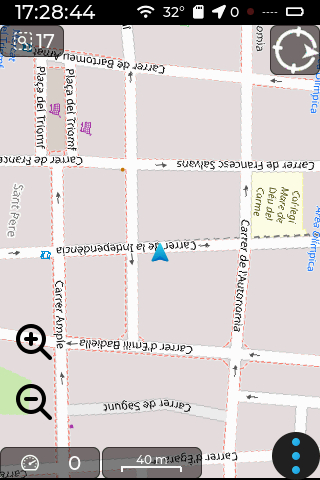
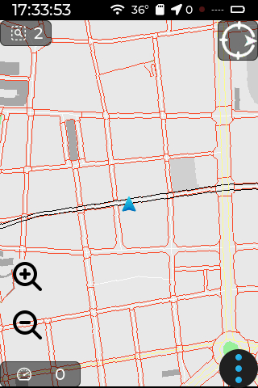
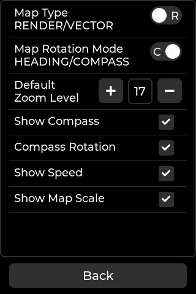

[](https://github.com/jgauchia/IceNav-v3/actions/) 


ESP32 Based GPS Navigator (LVGL - LovyanGFX).
* Note: Under development (experimental features under devel branch)
* There is the possibility to use two types of maps: Rendered Maps or Tiles (large files), and Vector Maps (small files).

<table>
  <tr>
    <td>
      Don't forget to star ⭐️ this repository
    </td>
   <a href="https://www.buymeacoffee.com/jgauchia" target="_blank" title="buymeacoffee"></a>
  </tr>
</table>

> [!CAUTION]
> Do not use in production (Experimental features).

## Screenshots
||||||
|:-:|:-:|:-:|:-:|:-:|
| Splash Screen | Compass | Rendered Map | Vectorized Map | Satellite Info |

||||||
|:-:|:-:|:-:|:-:|:-:|
| Settings | Compass Calibration | Touch Calibration | Map Settings | Device Settings |

## Specifications

For the moment Icenav works with the next hardware setup and specs **Highly recommended an ESP32 with PSRAM** :

### Customboard ESP32 setup

* ESP32 WROVER with 4Mb PSRAM / 16 Mb Flash
* SD/MicroSD reader
* HCM5883L Magnetometer
* BME280   Temperature / Humidity sensor
* MPU6050  Accelerometer and Gyroscope IMU
* HT1818Z3G5L GPS Module (AT6558D)

### Makerfabs ESP32-S3 setup

* ESP32-S3-WROOM-1 with 2Mb PSRAM / 16 Mb Flash
* MicroSD reader
* FT6236 Capactive Touch Panel Driver
* HT1612Z3M3L GPS Module (AT6558D)
* MPU9250 (Compass+IMU)

### Screens

| Driver [^1] | Resolution | SPI | 8bit | 16bit | Touch     | Build Flags [^2]                 |
|:-----------:|:----------:|:---:|:----:|:-----:|:---------:|:--------------------------------:|
| ILI9488     | 320x480    | yes | ---  | ---   | XPT2046   | ```-D ILI9488_XPT2046_SPI = 1``` |
| ILI9488     | 320x480    | --- | ---  | yes   | FT5x06    | ```-D ILI9488_FT5x06_16B = 1```  |
| ILI9341     | 320x240    | yes | ---  | ---   | XPT2046   | ```-D ILI9341_XPT2046_SPI = 1``` |

[^1]: See hal.hpp for pinouts configuration
[^2]: In the platformio.ini file under the build_flags section

Other setups like another sensors, etc... not listed in the specs,  now **They are not included**

If you wish to add any other type of sensor, module, etc., you can create a PR without any problem, and we will try to implement it. Thank you!

---

## Wiring

       Pinout (ESP32-WROVER)
       HCM5883L      BME280        MPU6050       ILI9488        SD CARD        VBAT             GPS
       -----------------------------------------------------------------------------------------------------
       VCC 3,3v      VCC 5v        VCC 3.3v      VCC  3,3v      VCC  3,3v      GPIO34           VCC  3,3v
       GND GND       GND GND       GND GND       GND  GND       GND  GND       ADC1_CHANNEL_6   GND  GND
       SDA GPIO21    SDA GPIO21    SDA GPIO21    LED  GPIO33    CS   GPIO4     (Resist. div)    RX   GPIO25
       SCL GPIO22    SCL GPIO22    SCL GPIO22    MISO GPIO27    MISO GPIO19                     TX   GPIO26
                                                 SCK  GPIO14    SCK  GPIO12
                                                 MOSI GPIO13    MOSI GPIO23
                                                 DC   GPIO15
                                                 RST  GPIO32
                                                 CS   GPIO2
                                                 LED  GPIO33
                                                 TCS  GPIO18
                                                 TIRQ GPIO5

       Pinout (ESP32S3-MakerFabs)
       GPS (HT1612Z3M3L)  MPU9250
       -----------------------------------------------------------------------------------------------------
       VCC 3,3v           VCC 3.3v
       GND GND            GND GND
       TX  GPIO17         SDA GPIO38
       RX  GPIO18         SCL GPIO39

## SD Map Tile File structure

Using [Maperitive](http://maperitive.net/) select your zone and generate your tiles. For that enter to `MAP-> Set Geometry bounds` draw or expand the square of your zone and run the command `generate-tiles minzoom=6 maxzoom=17`, It could takes long time, maybe 1 hour or more depending your area.


After that, copy the contents of directory `Tiles` into your SD in a directory called `MAP`.

On SD Card map tiles (256x256 PNG Format) should be stored, in these folders structure:

      [ MAP ]
         |________ [ zoom folder (number) ]
                              |__________________ [ tile X folder (number) ]
                                                             |_______________________ tile Y file.png

## SD Vectorized Map File structure          

Using [OSM_Extract](https://github.com/aresta/OSM_Extract) you can generate binary map files to later create vector maps. Once generated, these files should be saved in the `mymap` folder on the SD card.

The PBF files can be downloaded from the [geofabrik](https://download.geofabrik.de/) website.

The PBF files should be saved in the `pbf` directory. Once saved, you should select the region or boundaries for which the GeoJSON files will be generated.

To obtain the boundaries, please check the [geojson.io](http://geojson.io) website.

For generate GeoJSON files run inside `maps` directory:

```bash
ogr2ogr -t_srs EPSG:3857 -spat min_lon min_lat max_lon max_lat map_lines.geojson /pbf/downloaded.pbf lines

ogr2ogr -t_srs EPSG:3857 -spat min_lon min_lat max_lon max_lat map_polygons.geojson /pbf/downloaded.pbf multipolygons
```

For generate binary map files run inside `maps` directory.
```bash
/scripts/./extract_features.py min_lon min_lat max_lon max_lat map
```
Once the process is completed, the maps will be inside the `maps/mymap` directory. Copy all folders to the SD card except the `test_imgs` directory.

Please follow the instructions provided by [OSM_Extract](https://github.com/aresta/OSM_Extract) for any further questions.

## Firmware install


> [!IMPORTANT]
>Please install first [PlatformIO](http://platformio.org/) open source ecosystem for IoT development compatible with **Arduino** IDE and its command line tools (Windows, MacOs and Linux). Also, you may need to install [git](http://git-scm.com/) in your system.
> 
>For custom ESP32 board run:
> 
>```bash
>pio run --target upload
>```
>
>For ESP32S3 Makerfab board:
> 
>```bash
>pio run -e MAKERF_ESP32S3 --target upload
>```
>
> After the first run, load the icons and assets with:
> 
> ```bash
> pio run --target uploadfs
> ```


> [!TIP]
> Optional, for map debugging version with specific coordinates, build and install the firmware with the next environment variables, like this:
> 
> ```bash
> export ICENAV3_LAT=52.5200
> export ICENAV3_LON=13.4049
> pio run --target upload
> ```


> [!NOTE]
> For production version don't forget unset these environment variables.  

If the GPS module supports multiple GNSS, uncomment the following flag in the platformio.ini file under the build_flags section

```bash
-D MULTI_GNSS=1
```

Depending on the IMU used, it will be necessary to indicate the following flags in the platformio.ini file.

First enable the compass
```bash
-D ENABLE_COMPASS=1
```

IMU HMC5883L
```bash
-D IMU_HMC5883L=1
```

IMU MPU9250
```bash
-D IMU_MPU9250=1
```

### TO DO

- [X] LVGL 9 Integration
- [X] Support other resolutions and TFT models
- [X] Wifi CLI Manager
- [ ] GPX Integration
- [ ] Multiple IMU's and Compass module implementation
- [ ] Power saving
- [X] Vector maps
- [ ] Google Maps navigation style
- [x] Optimize code
- [ ] Fix bugs!
- [ ] Web file server
      
## Credits

* Added support to [Makerfabs ESP32-S3 Parallel TFT with Touch 3.5" ILI9488](https://www.makerfabs.com/esp32-s3-parallel-tft-with-touch-ili9488.html) thanks to [@hpsaturn](https://github.com/hpsaturn)
* Improved documentation thanks to [@hpsaturn](https://github.com/hpsaturn)
* Improved auto mainScreen selection from env variable preset thanks to [@hpsaturn](https://github.com/hpsaturn)
* Improved getLat getLon from environment variables thanks to [@hpsaturn](https://github.com/hpsaturn)
* 3DPrint case for an ESP32S3 Makerfabs Parallel board thanks to [@hpsaturn](https://github.com/hpsaturn)
* Vectorial Maps routines [ESP32_GPS](https://github.com/aresta/ESP32_GPS) thanks to [@aresta](https://github.com/aresta)
* OSM to binary vectorial maps [OSM_Extract](https://github.com/aresta/OSM_Extract) thanks to [@aresta](https://github.com/aresta)
* Preferences Library [Easy Preferences](https://github.com/hpsaturn/easy-preferences) thanks to [@hpsaturn](https://github.com/hpsaturn)
* Wifi CLI manager [esp32-wifi-cli](https://github.com/hpsaturn/esp32-wifi-cli) thanks to [@hpsturn](https://github.com/hpsaturn)
