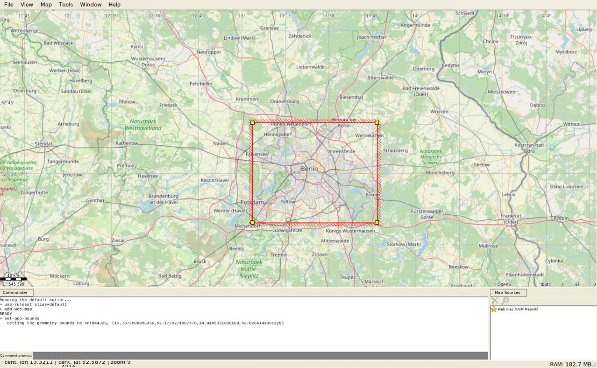

# SD Card File Structure

IceNav reads all of its data — map tiles, vector maps, routes, tracks and waypoints — from the SD card. The [`SD Card File Structure`](../SD%20Card%20File%20Structure) folder in this repository is a reference example of that layout, handy as a template when preparing a card.

## SD Renderized Map Tile File structure

Using [Maperitive](http://maperitive.net/) select your zone and generate your tiles. For that enter to `MAP-> Set Geometry bounds` draw or expand the square of your zone and run the command `generate-tiles minzoom=6 maxzoom=17`, It could takes long time, maybe 1 hour or more depending your area.



After that, copy the contents of directory `Tiles` into your SD in a directory called `MAP`.

On SD Card map tiles (256x256 PNG Format) should be stored, in these folders structure:

      [ 📁 MAP ]
         |________ [ 📁 zoom folder (number) ]
                              |__________________ [ 📁 tile X folder (number) ]
                                                             |_______________________ 🗺️ tile Y file.png

## SD Vectorized Map File structure

Vectorized maps for IceNav can be generated using the **nav_generator** utility, which is available on GitHub at [jgauchia/Tile-Generator](https://github.com/jgauchia/Tile-Generator). This program allows you to convert map data into the required vector tile format compatible with IceNav. Please refer to the Tile-Generator repository for detailed instructions and usage examples on generating and preparing your own vector map files.

The OSM PBF extracts can be downloaded from the [geofabrik](https://download.geofabrik.de/) website.

On SD Card vectorized files should be stored, in these folders structure:

      [ 📁 NAVMAP ]
            |_______ 🗺️ Z<zoom>.nav

> [!TIP]
> For optimal vectorized map performance, format the SD card with a **32 KB cluster size**.
> This reduces the number of sectors read per access and can significantly improve
> map rendering speed on both ESP32-S3 and ESP32-P4.
>
> ```bash
> # Windows (32 KB is already the default for FAT32 cards up to 32 GB)
> format /FS:FAT32 /A:32K X:\
>
> # Linux
> sudo mkfs.vfat -F 32 -s 64 -S 512 /dev/sdX1
> ```

## SD A* Route File structure

A* Route files for IceNav can be generated using the **route_generator** utility, which is available on GitHub at [jgauchia/Tile-Generator](https://github.com/jgauchia/Tile-Generator). This program allows you to generate the A* route files required for IceNav navigation. Please refer to the Tile-Generator repository for detailed instructions and usage examples on generating and preparing your own route files.

On SD Card route files should be stored, in these folders structure:

      [ 📁 ROUTE ]
            |_______ [ 📁 CAR ]
            |             |_______ 🔀 ROUTE.bin
            |
            |_______ [ 📁 BIKE ]
            |             |_______ 🔀 ROUTE.bin
            |
            |_______ [ 📁 WALK ]
                          |_______ 🔀 ROUTE.bin

## SD Track Logger File structure

IceNav includes a built-in GPX data logger that records your activity directly to the SD card. Recording is controlled from a **REC** button on the map screen, with adaptive sampling, auto-pause on low speed and a summary screen on stop.

Tracks are stored as GPX 1.1 files in the `TRK` folder. This folder holds both the tracks recorded by the device (named after the local start time) and any external tracks you add manually — for example GPX files downloaded from the web or exported from other apps and tools:

      [ 📁 TRK ]
            |_______ 🛰️ YYYYMMDD_HHMMSS.gpx   (recorded by the device)
            |_______ 🛰️ my_downloaded_route.gpx   (added manually)
            |_______ ...

The logger supports three activity profiles, selectable from **Settings → Device → Logger Profile**. The selected profile is stored in the `logProfile` preference `0` = Walk (default), `1` = Bike, `2` = Car. Each profile tunes the auto-pause threshold, sampling interval and minimum distance between points:

| Profile | Pause speed | Pause delay | Min interval | Max interval | Min distance | Reference speed |
|---------|-------------|-------------|--------------|--------------|--------------|-----------------|
| Walk    | 0.5 km/h    | 5 s         | 1000 ms      | 5000 ms      | 2 m          | 10 km/h         |
| Bike    | 2.0 km/h    | 10 s        | 2000 ms      | 15000 ms     | 8 m          | 40 km/h         |
| Car     | 5.0 km/h    | 30 s        | 5000 ms      | 30000 ms     | 25 m         | 130 km/h        |

## SD Waypoint File structure

IceNav stores waypoints as GPX files in the `WPT` folder. Waypoints created on the device (from **Add Waypoint**) are saved to the default `waypoint.gpx` file. You can also add your own GPX files manually — for example waypoints downloaded from the web or exported from other apps and tools. Each file may contain a single `<wpt>` or multiple ones, and all `.gpx` files found in the folder are loaded:

      [ 📁 WPT ]
            |_______ 📍 waypoint.gpx   (created by the device)
            |_______ 📍 my_waypoints.gpx   (added manually, one or more waypoints)
            |_______ ...
